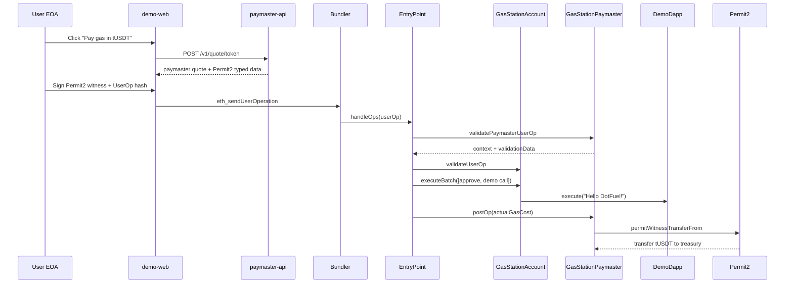
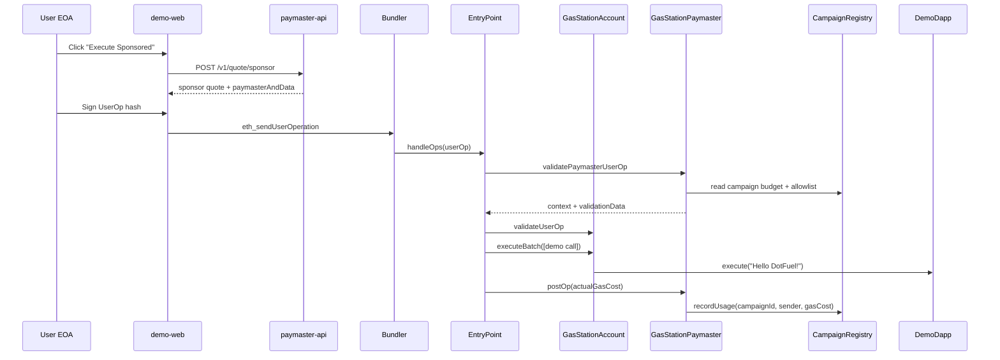

# DotFuel ⛽

**Universal Gas Station Paymaster for Polkadot Hub**

> Pay gas with any token. Zero PAS required.

---

## The Problem

Every new user on Polkadot Hub faces the same onboarding wall:

```
"You need PAS to pay gas."
"But I only have USDT."
"Then you can't do anything yet."
```

This is the #1 UX blocker for mass adoption on any EVM chain. DotFuel removes it.

---

## What DotFuel Does

DotFuel is a production-lean **ERC-4337 Account Abstraction** stack built specifically for Polkadot Hub that lets users execute any dApp action **without holding a single PAS or DOT**.

```
Before DotFuel:                     After DotFuel:
─────────────────────────────       ─────────────────────────────
User has tUSDT ✓                    User has tUSDT ✓
User has 0 PAS ✗                    User has 0 PAS — doesn't matter
User can't transact ✗               User transacts, pays gas in tUSDT ✓
```

**Two gas payment modes:**

| Mode | Who Pays Gas | How |
|---|---|---|
| Token Mode | User (in ERC-20) | Permit2 signature-based settlement in `postOp` |
| Sponsor Mode | dApp / campaign | Budget-limited, allowlisted sponsorship |

---

## Why This Is Polkadot-Native

Most ERC-4337 paymasters on other chains deal with standard ERC-20s. DotFuel is built around Polkadot's unique asset architecture:

1. **Assets pallet → ERC20 precompile**: Any token created on Asset Hub via the Assets pallet gets a deterministic ERC20 address. DotFuel treats these first-class — TokenRegistry stores the metadata (decimals, symbol) the precompile doesn't expose.

2. **XCM-ready**: Any parachain token that lands on Hub via XCM can be a gas token. No paymaster code changes needed — just add it to TokenRegistry.

3. **Zero infrastructure gap**: There is no production ERC-4337 stack on Polkadot Hub today. DotFuel is the first.

---

## Architecture

```
                          Polkadot Hub (EVM, Chain ID: 420420417)
┌──────────────────────────────────────────────────────────────────────┐
│                                                                       │
│   User EOA                                                            │
│      │                                                                │
│      ▼                                                                │
│  GasStationAccount ◄──── GasStationFactory (CREATE2)                 │
│  (EIP-1271 wallet)         counterfactual address                     │
│      │                                                                │
│      │  UserOperation                                                 │
│      ▼                                                                │
│  ┌──────────┐    validatePaymasterUserOp    ┌──────────────────────┐ │
│  │EntryPoint│ ◄──────────────────────────── │ GasStationPaymaster  │ │
│  │(ERC-4337)│                               │                      │ │
│  │          │ ──── postOp ───────────────► │  MODE_TOKEN_PERMIT2  │ │
│  └────┬─────┘                               │  or MODE_SPONSOR     │ │
│       │                                     └──────┬───────────────┘ │
│       │ execute                                    │                  │
│       ▼                                            │ permitWitness    │
│  ┌──────────┐   ┌───────────────┐  ┌──────────┐  │ TransferFrom     │
│  │ DemoDapp │   │ TokenRegistry │  │ Permit2  │◄─┘                  │
│  └──────────┘   │ (decimals +   │  │(Uniswap) │                     │
│                 │  risk params) │  └──────────┘                     │
│                 └───────────────┘                                    │
│                                   ┌──────────────────────────────┐  │
│   Assets pallet token             │ CampaignRegistry             │  │
│   ──ERC20 precompile──►  0x...    │ (budgets + allowlists)       │  │
│                                   └──────────────────────────────┘  │
└──────────────────────────────────────────────────────────────────────┘

Off-chain:
  ┌─────────────┐     ┌──────────────────┐     ┌────────────────────┐
  │   bundler   │     │  paymaster-api   │     │   bootstrap-assets │
  │  (docker)   │     │  /v1/quote/token │     │  WSS → Asset Hub   │
  │             │     │  /v1/quote/      │     │  create → mint →   │
  │  eth_send   │     │  sponsor         │     │  register token    │
  │  UserOp     │     └──────────────────┘     └────────────────────┘
  └─────────────┘

Frontend:
  demo-web (Next.js + viem)    sponsor-console
```

---

## Security Design

### Permit2 Witness Binding

DotFuel uses Uniswap Permit2's `permitWitnessTransferFrom` — not basic `permit`. Every signature is bound to:

```
GasStationWitness {
    sender:         smart account address
    callDataHash:   keccak256(userOp.callData)   // prevents calldata swap
    token:          payment token
    maxTokenCharge: charge ceiling
    validUntil:     expiry
    treasury:       payment recipient
}
```

This means a Permit2 signature cannot be replayed with different calldata, different charge, or to a different treasury — even if the nonce is the same.

### Deterministic Validation

No oracles. No HTTP calls in validation. The paymaster verifies:
- Paymaster quote signature (EIP-712, signed by `quoteSigner`)
- Permit2 signature (EIP-712, signed by user EOA, verified via EIP-1271)
- Token allowlist (TokenRegistry)
- Target allowlist (decoded `executeBatch` calls)

---

## Demo Flows

### Flow A: Token Mode (0 PAS wallet)

```
Precondition: wallet has 0 PAS, smart account has tUSDT

1. User connects EOA
2. App computes counterfactual smart account address
3. User clicks "Pay gas in tUSDT"
4. App → POST /v1/quote/token → gets Permit2 typed data
5. User signs Permit2 typed data with EOA (1 signature)
6. App builds UserOp → signs UserOp → sends to bundler

Mined in one transaction:
  ✓ Smart account deployed (if first time)
  ✓ tUSDT.approve(permit2, max) executed
  ✓ DemoDapp call executed
  ✓ postOp: Permit2 collects tUSDT to treasury

UI shows:
  Gas cost: 0 PAS
  Paid: X tUSDT
  Tx: [Blockscout link]
```

### Flow B: Sponsor Mode

```
Precondition: campaign funded and enabled

1. User clicks "Execute Sponsored"
2. App → POST /v1/quote/sponsor
3. UserOp mined with no token settlement
4. Campaign quota consumed on-chain

UI shows:
  Gas: Sponsored by [campaign name]
  Tx: [Blockscout link]
```

## Sequence Diagrams

### Flow A — Token Mode



### Flow B — Sponsor Mode



---

## Quick Start

### Prerequisites

- Foundry nightly
- Node >= 22.5, pnpm
- Docker + docker-compose

### Bundler Compatibility Note

As of **2026-03-17**, the public Hub TestNet RPC at `https://eth-rpc-testnet.polkadot.io/` responds to
`debug_traceCall` when a tracer is supplied (`callTracer`). That is the key compatibility check for keeping
`stackup/stackup-bundler:latest` as the default local bundler in `docker/docker-compose.yml`.

If Hub RPC behavior regresses before demo day, switch the bundler image to a traced-call-compatible alternative
such as Alto or Skandha instead of discovering the incompatibility during the live run.

### Environment Matrix

| File | Used By | Required Variables |
|---|---|---|
| `.env.example` | `scripts/bootstrap-assets.ts` | `RPC_URL_TESTNET`, `CHAIN_ID`, `ASSET_HUB_WSS`, `ASSET_HUB_SURI`, `ASSET_ID_HINT`, `ASSET_ADMIN_ADDRESS`, `ASSET_DEPLOYER_ADDRESS`, `COUNTERFACTUAL_ADDRESS`, `DEMO_USER_ADDRESS`, `ASSET_NAME`, `ASSET_SYMBOL`, `ASSET_DECIMALS`, `ASSET_MINT_AMOUNT`, `DRY_RUN`, optional `PRIVATE_KEY`, `TOKEN_REGISTRY_ADDRESS` |
| `contracts/.env.example` | `forge script script/Deploy.s.sol` | `PRIVATE_KEY`, `DEPLOYER_ADDRESS`, `TREASURY_ADDRESS`, `QUOTE_SIGNER_ADDRESS`, optional `ENTRYPOINT_ADDRESS`, `PERMIT2_ADDRESS`, `PAYMASTER_DEPOSIT_WEI`, `RPC_URL_TESTNET`, `CHAIN_ID`, `ETHERSCAN_API_KEY` |
| `docker/.env.example` | `docker compose -f docker/docker-compose.yml up` | `RPC_URL_TESTNET`, `BUNDLER_PRIVATE_KEY`, `ENTRYPOINT_ADDRESS`, `CHAIN_ID`, `PAYMASTER_ADDRESS`, `PERMIT2_ADDRESS`, `QUOTE_SIGNER_PRIVATE_KEY`, `ADMIN_PRIVATE_KEY`, `TOKEN_REGISTRY_ADDRESS`, `CAMPAIGN_REGISTRY_ADDRESS`, `TREASURY_ADDRESS`, `PORT`, `QUOTE_TTL_SECONDS` |
| `apps/paymaster-api/.env.example` | local `pnpm --filter paymaster-api dev` | `RPC_URL_TESTNET`, `CHAIN_ID`, `PAYMASTER_ADDRESS`, `PERMIT2_ADDRESS`, `QUOTE_SIGNER_PRIVATE_KEY`, `ADMIN_PRIVATE_KEY`, `TOKEN_REGISTRY_ADDRESS`, `CAMPAIGN_REGISTRY_ADDRESS`, `ENTRYPOINT_ADDRESS`, `TREASURY_ADDRESS`, `PORT`, `QUOTE_TTL_SECONDS` |
| `apps/demo-web/.env.local.example` | `pnpm --filter demo-web dev` | `NEXT_PUBLIC_WALLETCONNECT_PROJECT_ID`, `NEXT_PUBLIC_BUNDLER_RPC_URL`, `NEXT_PUBLIC_PAYMASTER_API_URL`, `NEXT_PUBLIC_ENTRYPOINT_ADDRESS`, `NEXT_PUBLIC_PERMIT2_ADDRESS`, `NEXT_PUBLIC_FACTORY_ADDRESS`, optional `NEXT_PUBLIC_COUNTERFACTUAL_ADDRESS`, optional `NEXT_PUBLIC_ACCOUNT_INIT_CODE`, `NEXT_PUBLIC_TOKEN_ADDRESS`, `NEXT_PUBLIC_DEMO_DAPP_ADDRESS`, `NEXT_PUBLIC_CAMPAIGN_ID` |

### 1. Bootstrap a test token on Hub TestNet

```bash
cd scripts
pnpm install
pnpm bootstrap-assets
# Output: assetId, ERC20 precompile address, mint tx hashes
```

### 2. Deploy contracts

```bash
cd contracts
cp .env.example .env    # fill in PRIVATE_KEY, RPC_URL_TESTNET
forge script script/Deploy.s.sol --rpc-url $RPC_URL_TESTNET --broadcast
```

`Deploy.s.sol` treats `ENTRYPOINT_ADDRESS` as an override for a pre-existing ERC-4337 EntryPoint v0.6 deployment.
If the variable is blank, the script deploys a fresh EntryPoint itself and writes the resolved address to
`deployments/testnet.json`.

The same rule applies to `PERMIT2_ADDRESS`. If you already deployed a live Permit2 instance on Hub TestNet, pass
that address in the environment; otherwise the script deploys DotFuel's `Permit2.sol` wrapper over Uniswap
SignatureTransfer and records the resulting address in `deployments/testnet.json`.

### 3. Start bundler + paymaster API

```bash
cp docker/.env.example docker/.env   # fill in contract addresses
docker-compose -f docker/docker-compose.yml up
```

### 4. Run the demo

```bash
cd apps/demo-web
pnpm dev
# Open http://localhost:3000
```

### 5. Run tests

```bash
cd contracts
forge test -vvv
```

---

## Contract Addresses (Polkadot Hub TestNet)

> Deployed during hackathon period. See `deployments/testnet.json` after running deploy script.

| Contract | Address |
|---|---|
| EntryPoint | _TBD_ |
| Permit2 | _TBD_ |
| GasStationFactory | _TBD_ |
| GasStationPaymaster | _TBD_ |
| TokenRegistry | _TBD_ |
| CampaignRegistry | _TBD_ |
| DemoDapp | _TBD_ |
| tUSDT (ERC20 precompile) | _TBD_ |

---

## Repository Structure

```
dotfuel/
  contracts/
    src/
      GasStationAccount.sol     Smart account (EIP-1271, executeBatch)
      GasStationFactory.sol     CREATE2 factory
      GasStationPaymaster.sol   Dual-mode paymaster
      TokenRegistry.sol         Token allowlist + decimals
      CampaignRegistry.sol      Sponsor campaigns
      DemoDapp.sol              Safe demo target
    test/                       Forge unit + integration tests
    script/Deploy.s.sol
  apps/
    demo-web/                   Next.js frontend
    paymaster-api/              Node/TS quote API
  packages/
    shared/                     ABI, types, Permit2 helpers
  scripts/
    bootstrap-assets.ts         Assets pallet → ERC20 precompile
  docker/
    docker-compose.yml
```

---

## Hackathon

**Event:** Polkadot Solidity Hackathon APAC 2026
**Track:** Track 1 — EVM Smart Contracts (DeFi)
**Network:** Polkadot Hub TestNet (Chain ID: 420420417)

---

## Technical Stack

| Layer | Technology |
|---|---|
| Smart Contracts | Solidity 0.8.17, Foundry |
| Account Abstraction | ERC-4337 |
| Token Approvals | Uniswap Permit2 (SignatureTransfer + Witness) |
| Signatures | EIP-712, EIP-1271 |
| Frontend | Next.js, viem |
| API | Node.js / TypeScript |
| Infrastructure | Docker, docker-compose |
| Network | Polkadot Hub EVM (Assets pallet ERC20 precompile) |

---

## Key Design Decisions

**Why Permit2 witness (not basic Permit2)?**
Basic `permit` only binds token + amount + spender. A witness extends this to bind the exact calldata being executed, the charge ceiling, and the treasury. This prevents an attacker from using a signed Permit2 to drain tokens even if they control the bundler.

**Why centralized quote signing (not oracle)?**
ERC-4337 validation must be deterministic and cheap. An on-chain oracle introduces variability that can cause simulation/execution divergence. A short-lived signed quote from the paymaster API gives the same security property with a 5-minute expiry.

**Why TokenRegistry (not token.decimals())?**
Polkadot Hub's ERC20 precompile for Assets pallet tokens doesn't expose `decimals()`. TokenRegistry stores this metadata on-chain, so the paymaster can compute correct token amounts without any off-chain metadata service.

---

## Known Limitations

- **Centralized token pricing:** token-mode quotes are signed by the paymaster API instead of sourced from an on-chain oracle. That is a deliberate tradeoff to keep ERC-4337 validation deterministic and simulation-safe during the hackathon scope.
- **Sponsor budget race window:** sponsor-mode validation can only read campaign budget during `validatePaymasterUserOp`; the final spend is recorded in `postOp`. Concurrent UserOps can therefore pass validation against the same remaining budget before settlement closes the gap.
- **Single bundler path:** the reference deployment assumes one bundler and no explicit MEV protection or failover. That is acceptable for demo reliability, but production rollout would need redundancy and mempool hardening.

---

## License

MIT
